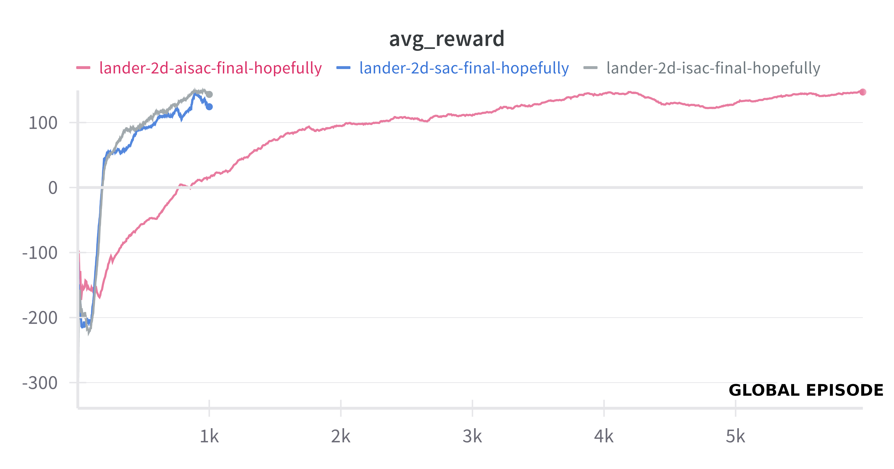
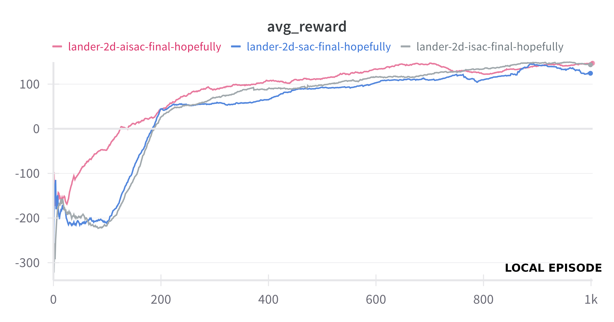
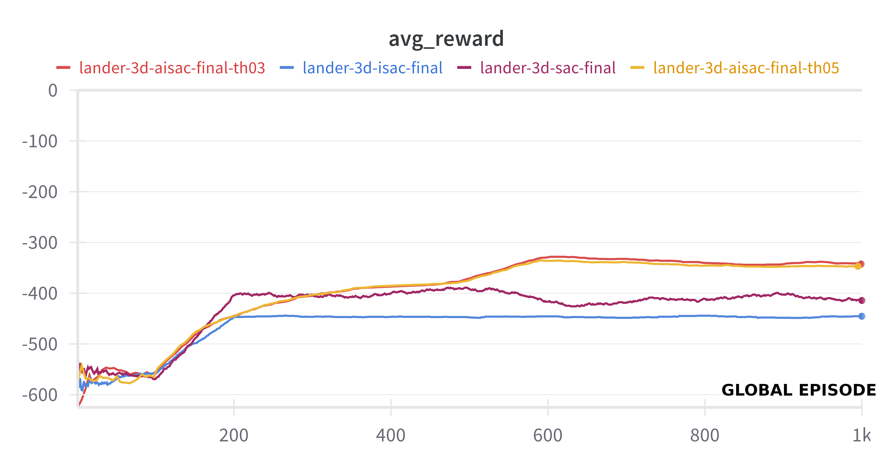
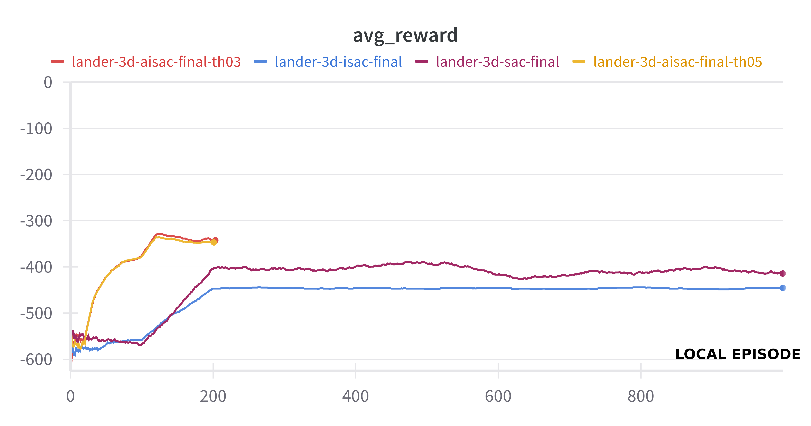

# Pin-Point Autonomous Lunar Landing
# Autonomous Precision Landing with ISAC and AISAC

## Introduction
This repository presents an implementation of the Improved Soft Actor-Critic (ISAC) architecture for performing autonomous precision landing—pin-point landing—on a planetary environment, specifically focusing on the lunar 3D environment,we also provide an experimentation of ISAC in the 2D enviroment lunar landing. Additionally, we introduce modifications to ISAC, resulting in Asyncronous-ISAC (our contribution), aimed at enhancing sample efficiency and performance in trajectory recalculation for fault recovery scenarios.
Our contribution to the field, AISAC, extends ISAC's capabilities by introducing asynchronous processing. This approach involves multiple sub-agents, each responsible for rollout without updating the network, thereby leveraging parallel processing for accelerated training.

## Abstracts of Implemented Papers
- **Deep Reinforcement Learning for Pin-Point Autonomous Lunar Landing: Trajectory Recalculation for Obstacle Avoidance:** This work aims to present a method to perform autonomous precision landing—pin-point landing—on a planetary environment and perform trajectory recalculation for fault recovery where necessary. In order to achieve this, we choose to implement a Deep Reinforcement Learning—DRL—algorithm, i.e. the Soft Actor-Critic—SAC—architecture. In particular, we select the lunar environment for our experiments, which we perform in a simulated environment, exploiting a real-physics simulator modeled by means of the Bullet/PyBullet physical engine. We show that the SAC algorithm can learn an effective policy for precision landing and trajectory recalculation if fault recovery is made necessary—e.g. for obstacle avoidance.
- **Improved Soft Actor-Critic: Mixing Prioritized Off-Policy Samples with On-Policy Experience:** Building upon SAC, ISAC introduces modifications to enhance sample efficiency and stability. These include a new prioritization scheme for selecting better samples from the experience replay buffer and a mixture of prioritized off-policy data with the latest on-policy data for training.

## Implementation Details
- **Environment:** Our experiments are conducted within a simulated lunar environment utilizing the robust Bullet/PyBullet physics engine. The 3D environment was generously provided by the original authors.
  - `python3 ISAC_train_torch.py`: Training script for ISAC.
  - `python3 AISAC_train_torch.py`: Training script for AISAC.
  - `python3 SAC_train_torch.py`: Training script for standard SAC.

## Getting Started
To initiate training for the respective algorithms, execute the following commands:
```bash
python3 ISAC_train_torch.py
python3 AISAC_train_torch.py
python3 SAC_train_torch.py
```

In our training framework, to understand the results of our esperimentation, it's crucial to understand the distinction between two points of view local episodes and global episodes:

- **Local Episode:** This refers to the episode counter specific to the main agent. It tracks the number of episodes the main agent has completed independently.
  
- **Global Episode:** On the other hand, global episodes represent a shared counter utilized across all agents, particularly in multi-processing setups. While the main agent may have completed 100 local episodes, the global episode count might exceed 100 due to the involvement of other agents. This shared counter ensures synchronization and coordination among all agents during training.

# Hyperparameters of main agent:

- `MAX_EPISODES`: 1000
- `MAX_STEPS`: 100
- `REPLAY_BUFFER_SIZE`: 10,000
- `REPLAY_BUFFER_THRESHOLD`: 0.3 (or 0.5)
- `BATCH_SIZE`: 64
- `HIDDEN_DIM`: 256
- `N_ASYNC_PROCESSES`: 2
- `ACTION_REPEAT`: 50 (Number of times to repeat each action in the 3D environment)

- `ENV`: '3d' (or '2d')
- `WEIGHTS_FOLDER`: 'AISAC_weights_3d' (or 'AISAC_weights_2d' or...)
- `LOAD_WEIGHTS`: False
- `RENDER`: False 
- `WANDB_LOG`: True
- `WANDB_RUN_NAME`: 'lander-3d-aisac' (or 'lander-2d-aisac')
- `USE_GPU_IF_AVAILABLE`: True
# Hyperparameters of sub-agents in AISAC case:
- `MAX_STEPS`: 100

## Results 2D enviroment
Results are presented in comparison with the standard SAC algorithm. Graphs and descriptions are provided below:

The performance comparison among ISAC, SAC, and AISAC reveals compelling insights. AISAC demonstrates superior efficiency, completing 5,000 episodes within the same timeframe that SAC and ISAC accomplish 1,000 episodes. This stark difference underscores AISAC's accelerated learning capabilities, showcasing its potential for rapid convergence and efficient exploration.
It's worth noting also that in the 2D environment, AISAC didn't yield improvements compared to SAC and ISAC. Despite its prowess in the 3D lunar landscape, AISAC's advantages may not translate directly to the 2D setting. This observation suggests that the effectiveness of AISAC could be context-dependent, influenced by the complexity and dynamics of the environment.

When considering local episodes, a notable observation emerges: there's a trend toward faster convergence within the initial 0-200 episode interval for AISAC. This accelerated convergence signifies the effectiveness of the algorithms in rapidly learning optimal policies early in the training process.
Furthermore, despite the variance in convergence speed, SAC, ISAC ans AISAC ultimately converge to comparable average reward levels. This convergence parity indicates that while the initial learning dynamics may differ, both algorithms achieve similar performance outcomes in terms of average reward over time.
## Results 3D enviroment

In the context of the 3D environment, AISAC emerges as a standout performer, surpassing both ISAC and SAC in terms of both average reward attainment and convergence speed. Notably, AISAC achieves higher average rewards compared to ISAC and SAC, and does so in a significantly shorter timeframe. This accelerated learning trajectory underscores the efficacy of AISAC's modifications in facilitating rapid policy optimization and enhancing exploration-exploitation dynamics.
Additionally, the stability of average rewards attained by AISAC and ISAC is notably higher compared to SAC. This enhanced stability is a valuable property, as it indicates more consistent performance across episodes and mitigates potential fluctuations in learning dynamics.

When examining the performance from the perspective of local episodes, it's important to note,as we said, that the main agent of AISAC completes its training (in this case) after 200 episodes, while the remaining 800 episodes are conducted by the sub-agents in parallel. Despite this division of labor, the total episode count remains consistent at 1,000 episodes.
One notable observation is the initial spike in performance exhibited by AISAC, reminiscent of its behavior in the 2D environment. This underscores AISAC's capacity for rapid learning and exploration, facilitated by its parallel processing capabilities.
Furthermore, AISAC not only demonstrates faster convergence but also achieves a higher reward compared to both SAC and ISAC. This enhanced performance highlights the efficacy of AISAC's modifications in promoting efficient exploration and policy optimization.
